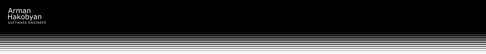

<h1>Hi there👋, I'm Arman, a freshly graduated Software Engineer</h1>

👨‍💻 Lorem ipsum dolor sit amet consectetur adipisicing elit. Iusto, repudiandae iste! Laboriosam alias, ut deserunt omnis nemo ea dolores culpa dolorem repellat, cum soluta enim laudantium corporis, maiores excepturi veniam inventore consequatur tempora. Repellat minus adipisci incidunt numquam ab veniam dolores explicabo eum, dolor enim natus iure odio necessitatibus est? Accusamus ratione repellendus fuga aliquid cum delectus voluptas quis consectetur rem voluptatum repudiandae harum quibusdam, aperiam dicta, deleniti impedit aut laudantium eligendi, numquam possimus odio. Possimus a aliquid voluptates? Minus quaerat vitae magni, debitis laborum, cupiditate minima distinctio mollitia neque earum eos recusandae dolores vel, sit consequatur repudiandae alias tenetur. Repudiandae, quisquam necessitatibus architecto corrupti quo minima accusantium quis, ea a, ducimus ab facilis at aperiam nisi cum reprehenderit quaerat. Repellat iusto earum animi consectetur voluptates placeat dolor dignissimos blanditiis similique atque asperiores aperiam ut veritatis expedita enim quos nesciunt nulla temporibus veniam voluptatum sunt, eligendi quae aliquam. Earum voluptate sit nobis molestias quas! Eum delectus nobis ducimus fuga repellat temporibus, eveniet, fugiat expedita eligendi molestiae fugit vitae sunt? Commodi deserunt consequatur tenetur sapiente nihil, labore perferendis incidunt delectus minus! Perspiciatis nesciunt similique rerum aspernatur molestias quisquam, ad eum optio id, sed nostrum voluptatum magni rem, facilis totam nihil repudiandae?

🔭 When I have the time, i'm working on [OpenNotes] (https://github.com/Arman-HKB/OpenNotes)

<h3 align="left">Want to connect with me ?</h3>

<h3 align="left">Languages and Tools I use ? (or used)</h3>

  
  
  
  
  
  
  
  
  
  
  
  
  
  
  
  
  
  
  
  
  
  
  
  
  
  
  

