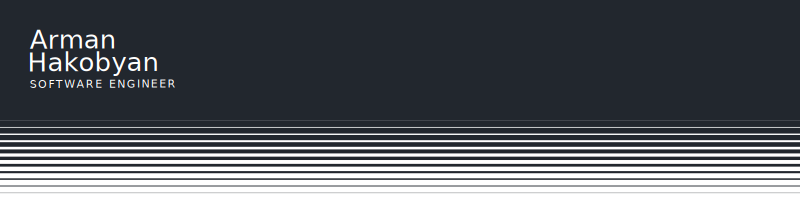

<h1>Hi there👋, I'm Arman, a freshly graduated Software Engineer</h1>

👨‍💻 Hello, I'm Arman and welcome to my GitHub profile. Feel free to take a look around! I'm a .NET/Angular developer in the French banking sector. I used to work as a PHP developer for laboratories. From time to time, I develop video games, although very few make it here. I would be delighted to discuss technology, metal/punk music, video games or collaboration with you!

🔭 When I have the time, i'm working on [OpenNotes] (https://github.com/Arman-HKB/OpenNotes)

<h3 align="left">Want to connect with me ?</h3>

<h3 align="left">Languages and Tools I use ? (or used)</h3>

  
  
  
  
  
  
  
  
  
  
  
  
  
  
  
  
  
  
  
  
  
  
  
  
  
  
  

