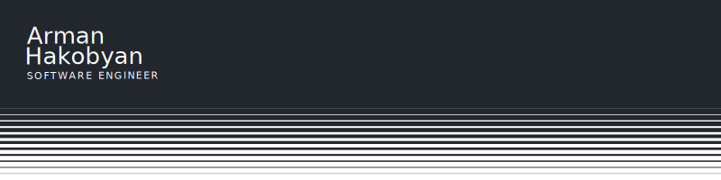

<h1>Hi there 👋 I'm Arman — .NET & Azure Engineer | Self-taught Game Developer</h1>

I'm a .NET & Azure Engineer working in the French banking industry, with a background in Web development.

I'm probably a bit of a tech boomer. New frameworks never excite me, and I don't feel the need to jump on every new trend. I'd rather become really good at the tools I already use than constantly switch to the latest shiny thing. .NET Framework 4.8 FOREVER!!!

Outside of work, I'm playing the self-taught game developer. Over the past decade I've built numerous hobby projects and prototypes. All are private, too shameful ahahah, but I'm gradually cleaning up the code, improving the documentation, and open-sourcing the projects I'm happy to share.

<h3 align="left">Want to connect with me ?</h3>

<h3 align="left">Languages and Tools I daily use ? (or used)</h3>

  
  
  
  
  
  
  
  
  
  
  
  
  

